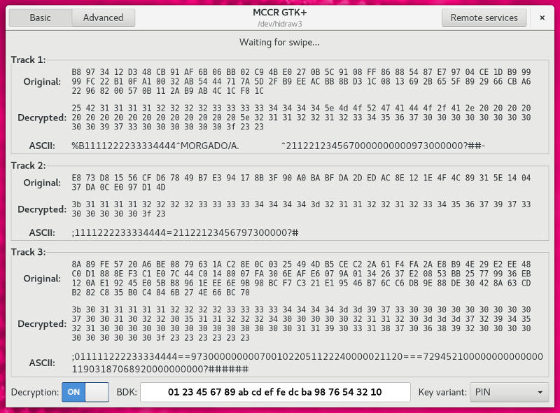
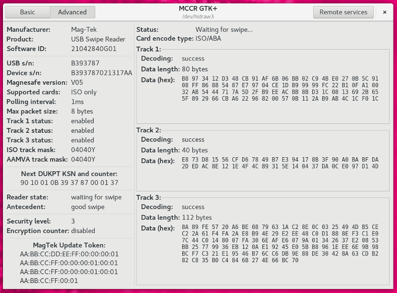
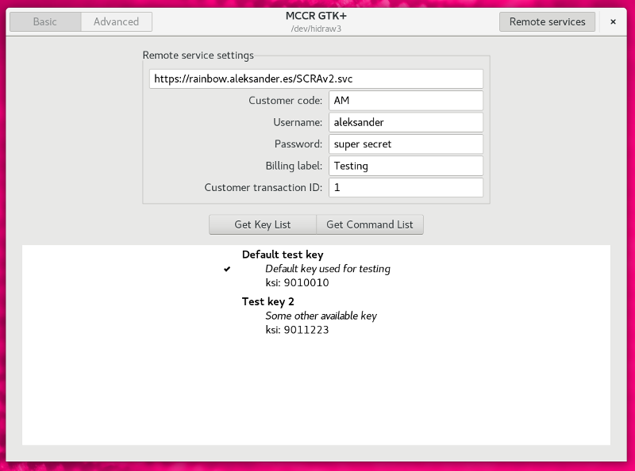

# MCCR

## Components

### libmccr

`libmccr` is a small **[C library](https://aleksander0m.github.io/mccr/)** that
allows controlling MagTek credit card readers in HID mode.

### mccr-cli

`mccr-cli` is a simple program that uses libmccr to query device information or
process user swipes, printing out the swipe report information in standard
output.

### mccr-gtk

`mccr-gtk` is a GTK+ based graphical user interface program that provides swipe
information support, including track data decryption if the Base Derivation Key
is known. The program also allows performing device setting changes and key
updates using MagTek's *Magensa* remote service system.

------
Basic application view showing swipe information, including decrypted contents if
supported:

<p align="center"></p>

------
Advanced application view including device properties and status information:

<p align="center"></p>

------
Remote services view, enabling the user to update device keys or perform
configuration commands:

<p align="center"></p>

## Building

### libmccr and mccr-cli options and dependencies

The basic dependencies to build the MCCR project are **hidapi** with either
the *usb* or *raw* backend, **libusb** (only if the *hidapi usb* backend is
requested) and **gtk-doc** (only if building from a git checkout).

When using the *usb* backend, the library needs to claim the interface in order
to read the HID report descriptor, and that involves detaching the kernel driver
and re-attaching it afterwards, which may end up re-enumerating /dev entry
names.

When using the *raw* backend, the library is able to read the HID report
descriptor directly from the kernel.

The hidapi backend to use may be selected with the
`--with-hidapi-backend=[usb|raw]` configure option, and will default to *raw* if
not explicitly given, as that is the less invasive mode of operation.

On a Debian based system, the dependencies may be installed as follows:
```
$ sudo apt-get install libhidapi-dev libusb-dev gtk-doc-tools
```

### mccr-gtk options and dependencies

Building the `mccr-gtk` program (enabled by default) may be disabled with the
`--disable-mccr-gtk` configure option.

The dependencies to build the GTK+ based application are
**[libdukpt](https://github.com/aleksander0m/libdukpt)**, **gtk+ >= 3.10**,
**glib >= 2.40**, **gudev >= 147**, **libxml >= 2** and **libsoup >= 2.42**.

On a Debian based system, the additional dependencies may be installed as
follows:
```
$ sudo apt-get install libglib2.0-dev libgtk-3-dev libgudev-1.0-dev libsoup2.4-dev libxml2-dev
```

### configure, compile and install

```
$ NOCONFIGURE=1 ./autogen.sh     # only needed if building from git
$ ./configure --prefix=/usr
$ make
$ sudo make install
```

## License

The `libmccr` library is licensed under the LGPLv2.1+ license, and the
`mccr-cli` and `mccr-gtk` programs under the GPLv2+ license.

* Copyright © 2017 Zodiac Inflight Innovations
* Copyright © 2017 Aleksander Morgado <aleksander@aleksander.es>

---

* MagTek® is a registered trademark of [MagTek, Inc](https://www.magtek.com).
* MagneSafe™ and Magensa™ are trademarks of [MagTek, Inc](https://www.magtek.com).
